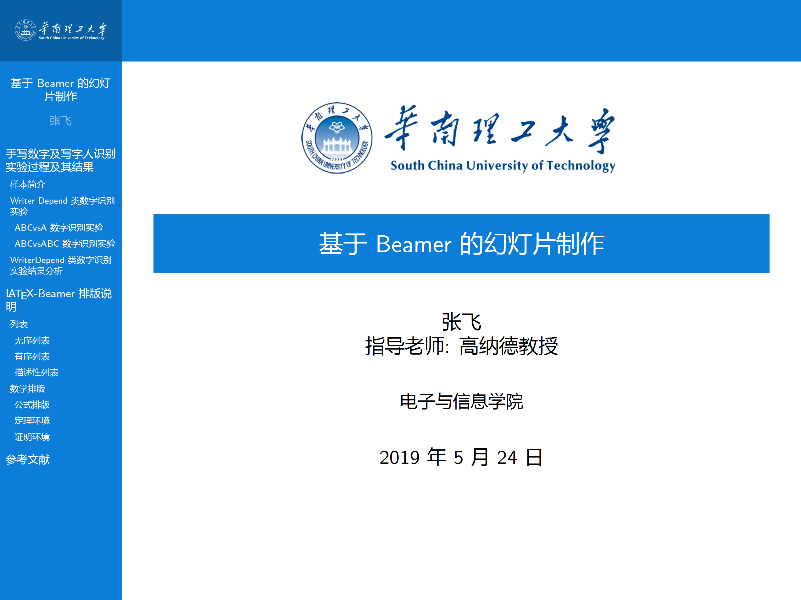

# 华南理工大学本科毕业论文及幻灯片模板
本模板是非官方的华南理工大学学士学位论文模板, 按照官方 Word 模板基于 [上海交通大学学位论文模板](https://github.com/sjtug/SJTUThesis) 修改得到. 本模板生成的模板可参考 `pdf/thesis.pdf` 文件. 在 SJTUThesis 的基础上, 还添加了华工风格的幻灯片模板.

当前模板已基本符合毕业论文模板的要求, 当然其中还存在一些不够完善的细节, 希望大家提出改进意见, 如果在模板的使用过程中遇到什么问题, 也欢迎提出 issue.

模板当前只支持学士学位论文, 将来也许能进一步改进以支持研究生学位论文, 希望更多的同学一起参与进来完善本项目!

<div align="center">
    <a href="./pdf/thesis.pdf"></a>
    <a href="./pdf/slide.pdf"></a>
</div>

## 使用方法
### 撰写论文
在 `bib/thesis.bib` 文件中加入所需要使用的参考文献 (大多数学术网站, 文献管理
软件都支持 bibTeX 格式引用的导出), 修改 `tex` 目录下的文件:
- `metadata.tex`: 在文件中填入论文的基本信息, 如论文题目, 学生姓名, 学号等;
- `abstract.tex`: 使用 `chineseabstract` 和 `englishabstract` 环境撰写中英文摘要;
- `chapterXX.tex`: 编写各章节内容;
- `thanks`: 使用 `thanks` 环境编写致谢内容.

## 编写幻灯片
在 `tex/slide/XXX.tex` 中编写各个页面的具体的页面, 然后在 `slide.tex` 中导入
编译即可. 目前是第一个版本, 可能存在 bug, 欢迎大家提出建议或直接贡献代码.

通常来说每一个幻灯片页对应一个 `frame` 环境, 使用 `frametitle` 来为一页设定标题, 
也可以用 `framesubtitle` 来设定小标题, 例如

```tex
\begin{frame}
\frametitle{My Title}
\framesubtitle{My Subtitle}
...
```

`frame` 环境提供了一个简便的一个写法, 上面的语句也等价于
```tex
\begin{frame}{My Title}{My Subtitle}
...
```


### 编译
#### Windows 平台
首先安装 TeX live 套件, 推荐使用 2017 年以后的版本. 然后在命令行执行下面的命令
```shell
git clone https://github.com/Phreer/scutthesis.git
cd scutthesis
latexmk --xelatex thesis.tex
```
如果参考文献没有排入, 需要再次执行 `latexmk --xelatex thesis.tex`, 生成的文档为 `thesis.pdf`.

#### macOS
TeX live 在 macOS 上对应的套件为 macTeX. 由于 macOS 和 Windows 平台预装字体的差异, 需要在先将 `scutthesis.cls` 文件中的
```latex
%% 约 64 行
\let\cusongti\relax
\newCJKfontfamily\cusongti{SimSun}[AutoFakeBold]
\let\cuheiti\relax
\newCJKfontfamily\cuheiti{Hei}[AutoFakeBold]
```
部分注释掉, 然后取消下面几行的注释
```latex
% \let\cusongti\relax
% \newCJKfontfamily\cusongti{STSong}[AutoFakeBold]
% \let\cuheiti\relax
% \newCJKfontfamily\cuheiti{Heiti}[AutoFakeBold]
```
可以使用 GNU make 来进行编译
```shell
git clone https://github.com/Phreer/scutthesis.git
cd scutthesis
make
```

## 致谢
本项目的完成得益于很多之前的工作, 为此由衷感谢
- 为 [上海交通大学学位论文模板](https://github.com/sjtug/SJTUThesis) 做出贡献的同学;
- `ctex` 宏包的开发者, 他们让 LaTeX 中文排版变得容易.